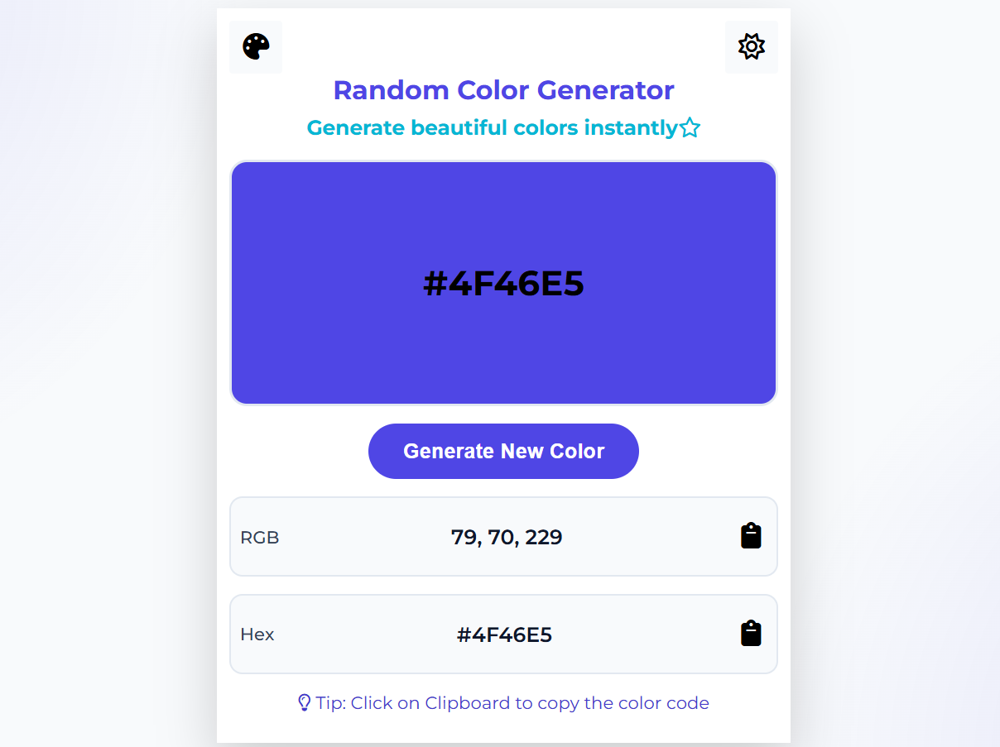
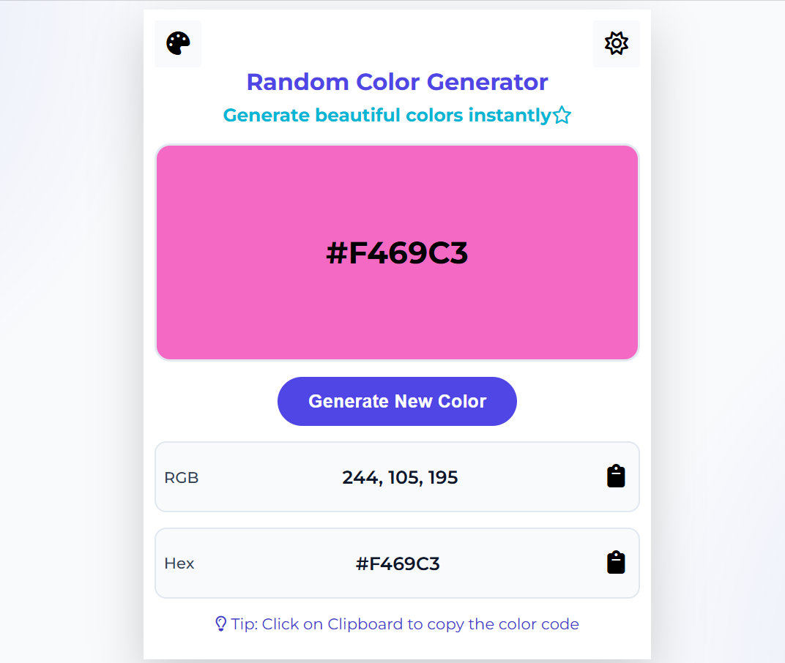
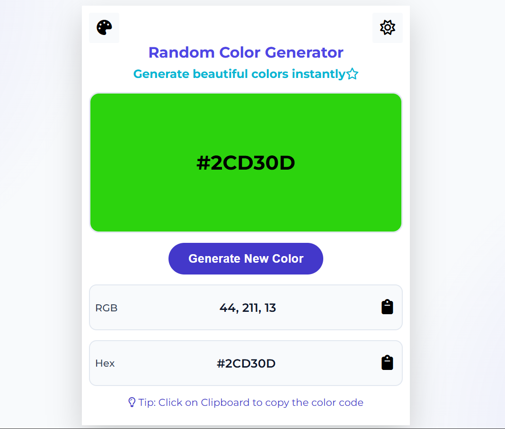
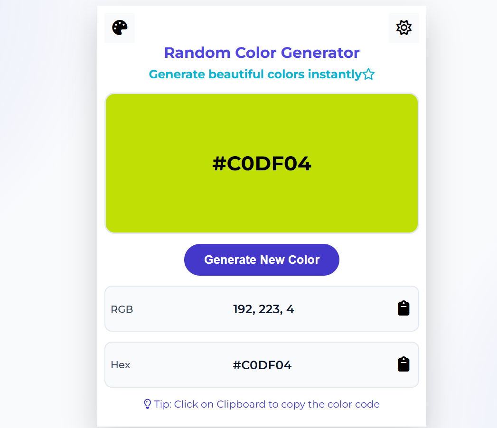

# 🎨 Random Color Generator

A simple and modern **Random Color Generator** built using **HTML, CSS, and JavaScript**. Generate random colors instantly, preview them in real time, and copy their HEX or RGB values with a single click.

---

## ✨ Features

- 🎲 Generate random colors instantly
- 🎨 Live color preview
- 📋 Copy HEX color code to clipboard
- 📋 Copy RGB color value to clipboard
- 💡 Helpful tip for users
- 📱 Fully responsive design
- ⚡ Clean, modern, and lightweight UI

---

## 🛠️ Built With

- HTML5
- CSS3
- JavaScript (ES6)

---
<h2>📸 Preview</h2>






```

---

## 🚀 Live Demo

🔗 **Live Website: https://www.linkedin.com/posts/laxmihasija_webdevelopment-frontenddevelopment-html-ugcPost-7478658092059029505-Xp9w/?utm_source=social_share_send&utm_medium=member_desktop_web&rcm=ACoAAFn3EmIB5oRmapx5UqZFHyf2Jb7n6Jb4ZPs**  


---

## 📂 Project Structure

```
Random-Color-Generator/
│
├── index.html
├── style.css
├── script.js
├── README.md
└── images/
    └── screenshots.png
```

---

## 🎯 How to Use

1. Open the website.
2. Click the **Generate New Color** button.
3. A random color is generated instantly.
4. View the corresponding **HEX** and **RGB** values.
5. Click the clipboard icon beside HEX or RGB to copy the value.

---

## 🔮 Future Enhancements

- ❤️ Favorite colors
- 📜 Color history
- 🌈 Gradient generator
- 🌙 Dark mode
- 🎨 Color palette generation
- 📤 Share colors with others

---

## ⭐ Support

If you like this project, consider giving it a ⭐ on GitHub!

---

## 👩‍💻 Author

**Laxmi**

GitHub: https://github.com/laxmi-hasija

---

## 📄 License

This project is licensed under the **MIT License**.

---

Made with ❤️ using **HTML, CSS & JavaScript**.
